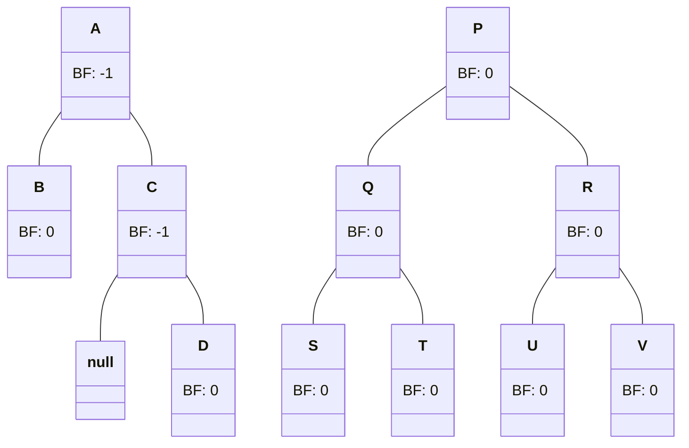
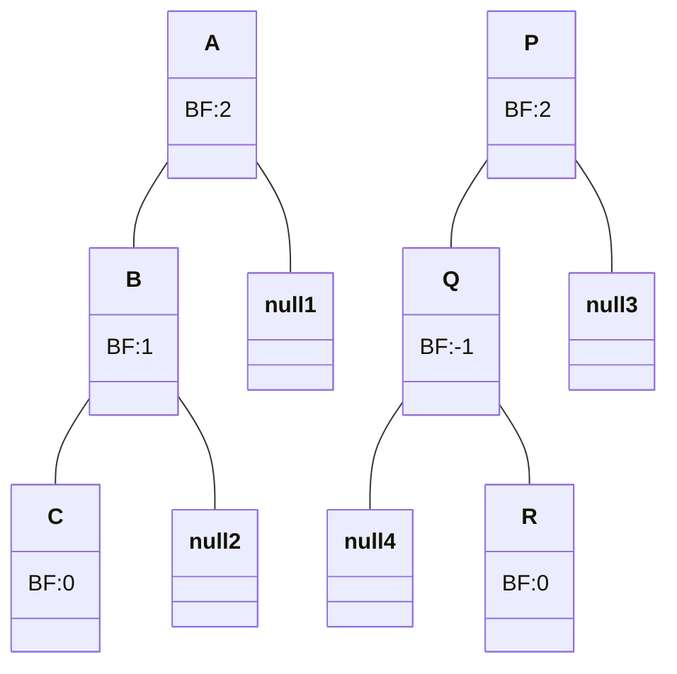

In a complete binary tree or complete BST with $n$ nodes, for accessing a node:
- Best Case: $O(1)$ for the root node
- Worst Case: $O(log n)$ for a leaf node

For a right-skewed BST with $n$ nodes:
- Best Case: $O(1)$ for the root node
- Worst Case: $O(n)$ for a leaf node

# AVL tree
- AVL tree is a balanced BST where the worst case to perform any operation is $O(log n)$.
- The **balance factor (BF)** of each node in the tree is $0, +1$ or $-1$.
> Balance factor of a node: height of left subtree $-$ height of right subtree
- The BF of leaf nodes will be $0$.
- The BF of all nodes in a complete binary tree are $0$.

These two are valid AVL trees.

This is not a valid AVL tree

> nullX are all regular NULL, mermaid doesn't support duplication.

## [Rotation](https://en.wikipedia.org/wiki/Tree_rotation)

Rotation is an operation performed to convert an unbalanced BST to a balanced BST (AVL).
Two types are:
- Single rotation
  - Left rotation (L)
  - Right rotation (R)
- Double rotation
  - Left right rotation (LR)
  - Right left rotation (RL)
> :warning:REMEMBER TO WRITE THE BF FOR EACH NODE EVERY TIME

